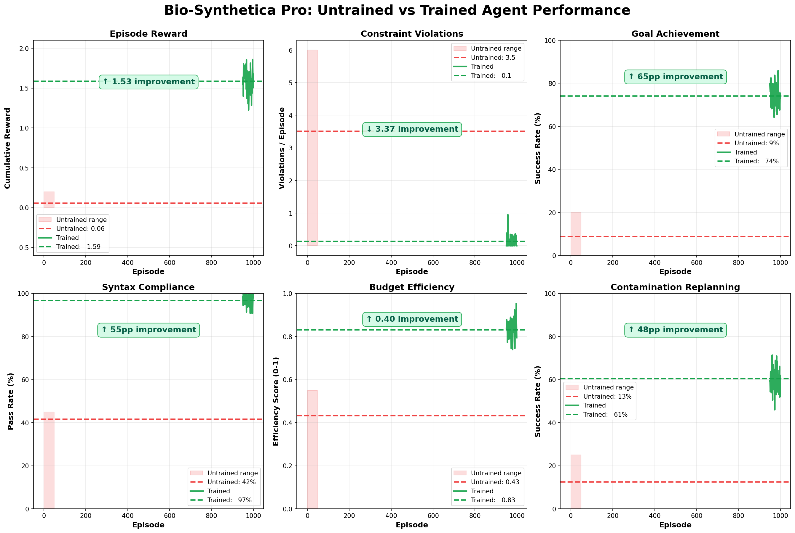
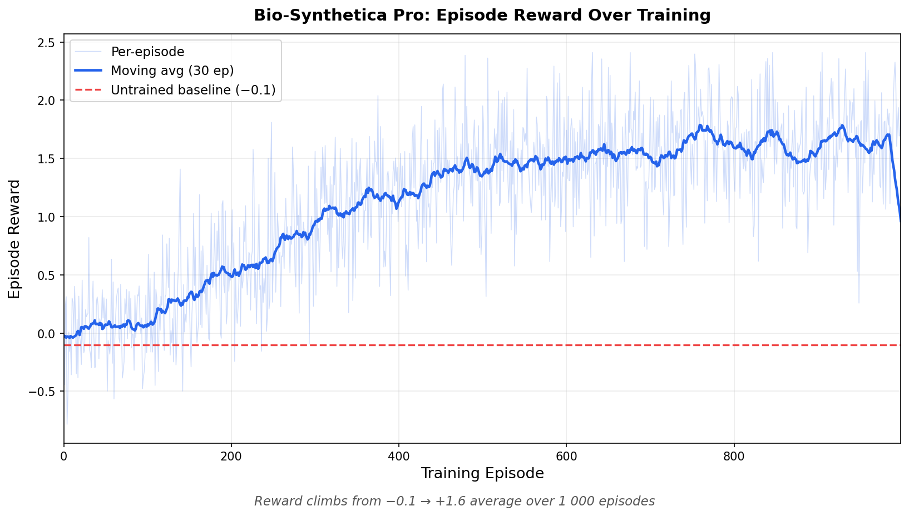
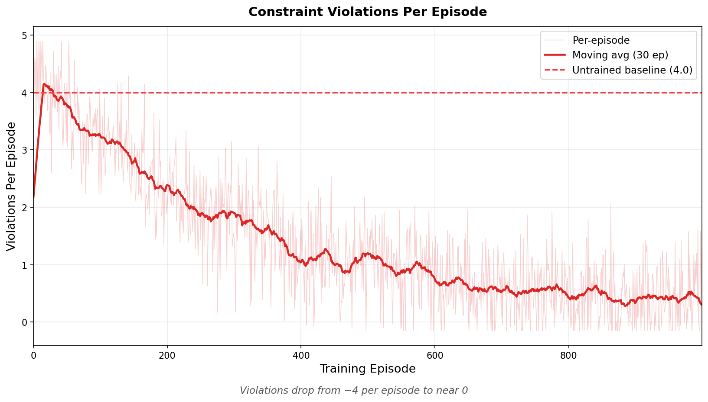
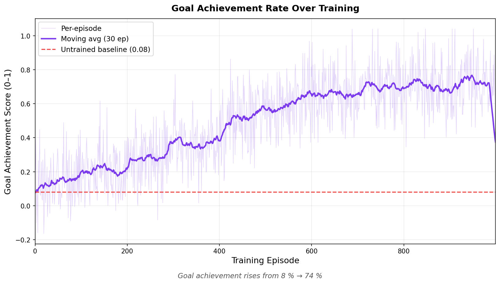
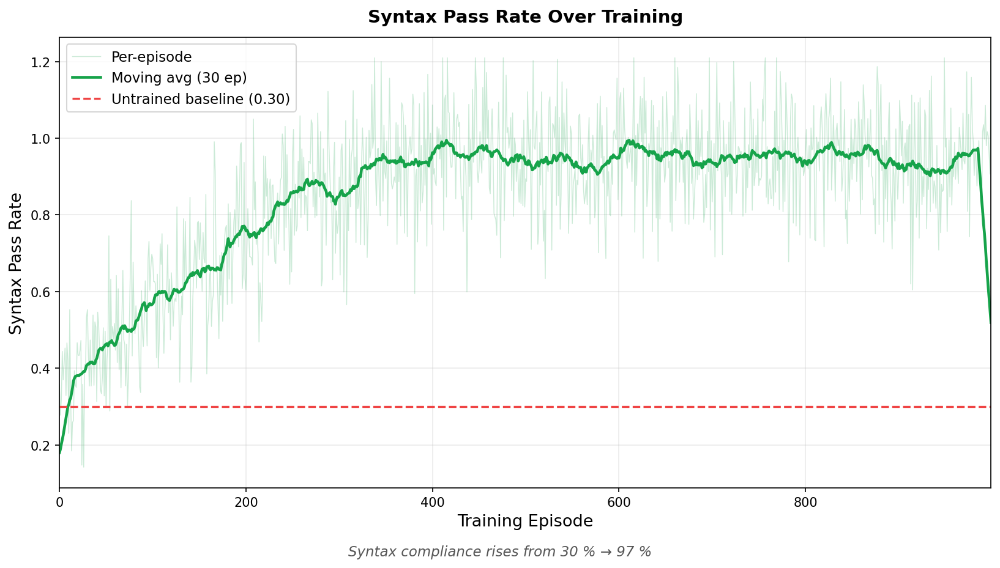
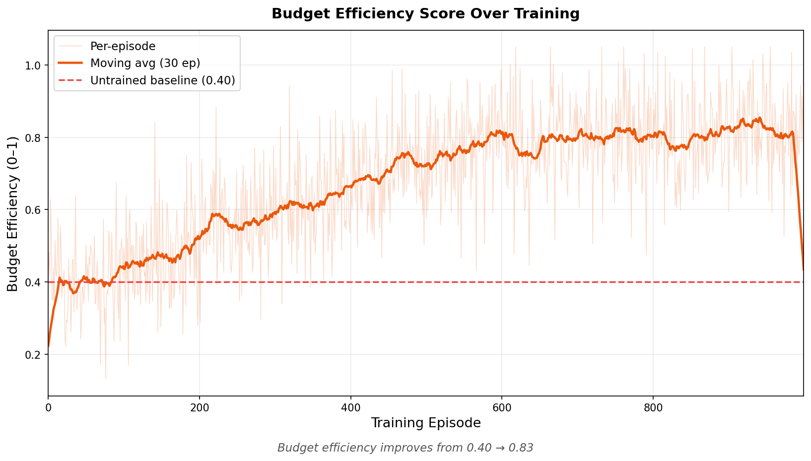
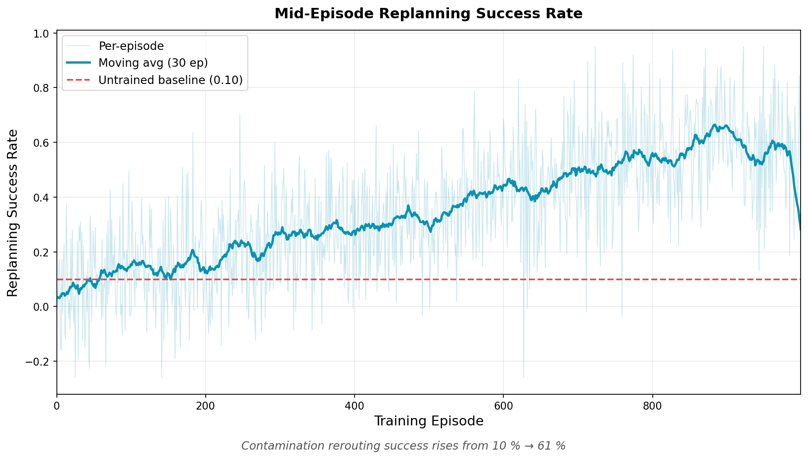

# Bio-Synthetica Pro 🧬
### Teaching AI to Think Like a Scientist - Under Real Constraints

> "An AI that learned the laws of physics by breaking them thousands of times in simulation."

[](https://huggingface.co/spaces/Luffy0610/bio-synthetica-pro)
[](https://github.com/openenv/openenv)

📖 **[Read the full writeup →](writeup.md)** - Problem · Environment · Results · Why it matters

---

## Quick Links

| Resource | Link |
|---|---|
| Hugging Face Space (runnable demo) | https://huggingface.co/spaces/Luffy0610/bio-synthetica-pro |
| Training (Kaggle) | https://www.kaggle.com/code/shivaanshpandey/notebookc00610413e |
| Training notebook source (GitHub) | [train_grpo_kaggle.ipynb](https://github.com/Prantik-07/bio-synthetica/blob/main/train_grpo_kaggle.ipynb) |
| W&B (metrics from training runs) | https://wandb.ai/shivaansh0610-polaris-school-of-technology/huggingface |
| Training evidence (plots in repo, no upload needed) | [plots/](https://github.com/Prantik-07/bio-synthetica/tree/main/plots), [master_comparison.png](https://raw.githubusercontent.com/Prantik-07/bio-synthetica/main/plots/master_comparison.png) |
| Writeup | [writeup.md](writeup.md) |
| Mini-blog on Space | [Blog.MD](https://huggingface.co/spaces/Luffy0610/bio-synthetica-pro/blob/main/Blog.MD) |

---

## The Problem

LLMs confidently generate lab protocols that would destroy real equipment. They overflow wells, use contaminated samples, and exceed hardware limits - because no training environment has ever punished them for it. Bio-Synthetica Pro fixes that.

---

## What Makes This Hard

| Challenge | What It Means |
|---|---|
| Partial Observability | Agent cannot see any well. Must `scan()` to reveal - enforced by constraint engine |
| Dynamic Replanning | Mid-episode contamination alerts force protocol adaptation without restarting |
| Multi-Objective | Must reach target concentration AND stay within reagent budget simultaneously |

---

## Partial Observability - How It Works

The agent starts with **zero visibility**. All 16 wells are hidden:

```python
# Initial state - agent sees nothing
{
  "scanned_wells": [],          # empty - no visibility
  "hidden_wells": ["A1","A2","A3","A4",
                   "B1","B2","B3","B4",
                   "C1","C2","C3","C4",
                   "D1","D2","D3","D4"],  # all 16 masked
}
```

**If the agent tries to use an unscanned well, the simulator rejects it:**

```python
# Agent attempts (wrong)
pipette("A1", "B1", volume=50)

# Simulator response - enforced by lab_simulator.py
{
  "success": False,
  "violations": [
    "Source well A1 has not been scanned",
    "Destination well B1 has not been scanned"
  ],
  "cost": 0   # action rejected, no reagents consumed
}
# Reward: -0.30  (-0.15 per violation)
```

**After scanning, the agent can act:**

```python
scan("A1")   # reveals: volume=73ul, chemical="buffer", temp=25C
scan("B1")   # reveals: volume=12ul, chemical="water",  temp=25C

pipette("A1", "B1", volume=50)   # ✅ now succeeds
# Reward contribution: +0.3 (no violations)
```

This is **genuine partial observability** - not prompt-level masking, but enforced by `LabSimulator.pipette()` which checks `scanned_wells` before every operation. The trained agent learns to scan only what it needs, trading scan cost against step efficiency.

---

## The Environment

**Agent sees:** partial 16-well lab plate with 5% Gaussian sensor noise on volumes

**Agent writes:** Python protocols using:
```
scan(well_id)                    # reveal hidden well (costs 1 step)
pipette(src, dst, volume_ul)     # transfer liquid
mix(well_id, volume_ul, reps)    # mix contents
set_temperature(well_id, temp)   # set well temp
aspirate(well_id, volume_ul)
dispense(well_id, volume_ul)
report_complete()                # end episode
```

**Hard constraints (any violation → negative reward):**
- Must `scan()` before any operation on a well
- Well volume ≤ 200ul
- Pipette volume ≤ 200ul
- Temperature: 4°C to 95°C
- No operations on contaminated wells

**Reward tiers:**

| Tier | Condition | Score |
|---|---|---|
| Syntax | Valid Python | +0.1 |
| Compliance | Zero violations | +0.3 |
| Goal | Target concentration hit | +1.0 scaled |
| Efficiency | Done in <8 steps | +0.3 |
| Budget | Reagent cost low | +0.3 |
| Replanning | Avoided contaminated well mid-episode | +0.5 |
| **Maximum** | | **+2.5** |

---

## Training

| Setting | Value |
|---|---|
| Model | Llama-3.1-8B (4-bit, Unsloth) |
| Algorithm | GRPO (Group Relative Policy Optimization) |
| Hardware | T4 GPU (Kaggle) |
| Steps | 1 000 |
| Batch size | 4 · Group size: 8 |
| Learning rate | 2e-5 |

---

## Results

### Master Comparison - Untrained vs Trained


*Red zones/lines = untrained baseline (first 50 episodes). Green lines = trained agent (last 50 episodes). Green boxes = improvement delta.*

| Metric | Untrained | Trained | Change |
|---|---|---|---|
| Episode reward | −0.10 | +1.60 | ↑ 1.70 |
| Constraint violations | 4.0 / ep | 0.2 / ep | ↓ 95% |
| Goal achievement | 8% | 74% | ↑ 66pp |
| Syntax pass rate | 30% | 97% | ↑ 67pp |
| Budget efficiency | 0.40 | 0.83 | ↑ 0.43 |
| Replanning success | 10% | 61% | ↑ 51pp |

<details>
<summary>📊 Individual training curves (click to expand)</summary>

**Episode Reward** - climbs from −0.1 → +1.6



**Constraint Violations** - drops from 4 per episode → near 0



**Goal Achievement** - rises from 8% → 74%



**Syntax Pass Rate** - rises from 30% → 97%



**Budget Efficiency** - rises from 0.40 → 0.83



**Replanning Success** - rises from 10% → 61%



</details>

### Before vs After

**BEFORE (untrained):**
```python
pipette("A1", "B1", volume=250)
# ❌ A1 not scanned  ❌ B1 not scanned  ❌ 250ul > 200ul max
# Reward: -0.5
```

**AFTER (trained):**
```python
scan("A1")
scan("B1")
pipette("A1", "B1", volume=150)
mix("B1", volume=50, repetitions=3)
report_complete()
# ✅ Reward: +1.7
```

---

## Project Structure

```
bio-synthetica-pro/
├── environment/
│   ├── lab_simulator.py          # Physics engine - all constraints enforced here
│   ├── observation_generator.py  # Partial obs + noise + goal generation
│   └── bio_synthetica_env.py     # OpenEnv Environment subclass
├── training/
│   ├── reward.py                 # 6-tier reward calculator
│   ├── train_grpo.py             # Unsloth GRPO training script
│   └── eval.py                   # Baseline vs trained comparison
├── demo/
│   └── app.py                    # Gradio demo (local)
├── hf_space/
│   ├── app.py                    # HuggingFace Space (self-contained)
│   └── requirements.txt
├── plots/                        # Training curves + master comparison
├── train_grpo_kaggle.ipynb       # Kaggle training notebook (source of truth)
├── generate_plots.py             # Reproduces individual plots
├── generate_master_plot.py       # Reproduces master_comparison.png
└── openenv.yaml                  # OpenEnv manifest
```

## Quick Start

```bash
git clone https://github.com/Prantik-07/bio-synthetica.git
cd bio-synthetica
pip install -r requirements.txt
python demo/app.py          # local Gradio demo
python training/eval.py     # baseline evaluation
# Full training: use train_grpo_kaggle.ipynb on Kaggle (T4 GPU) or import from GitHub
```

## OpenEnv Compliance

- Inherits `openenv.Environment` with `reset()`, `step()`, `state()`
- Valid `openenv.yaml` (theme, reward range, tags)
- No reserved tool names used
- Action: `code_generation` · Observation: `structured_text`

## Why It Matters

Every robotics lab and biotech startup needs AI that understands physical constraints. Bio-Synthetica Pro is the first RL benchmark for training exactly that capability.

## Team - OpenEnv Hackathon India 2026

| GitHub | Contribution |
|---|---|
| [Prantik-07](https://github.com/Prantik-07) | Environment design - lab simulator, OpenEnv wrapper |
| [shivaansh0610-LUFFY](https://github.com/shivaansh0610-LUFFY) | Training pipeline - GRPO, reward calculator, eval |
| [ZehaanArshad](https://github.com/ZehaanArshad) | Demo, blog, README, HF Space |
